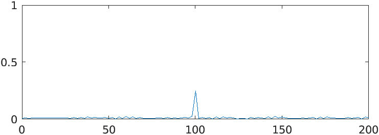
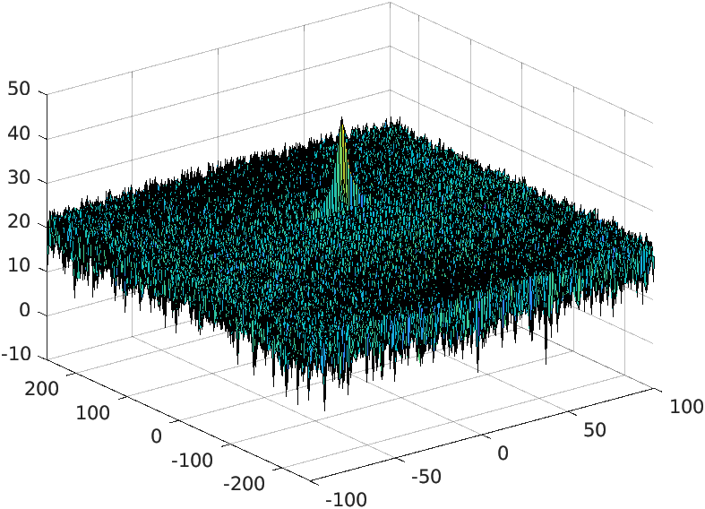
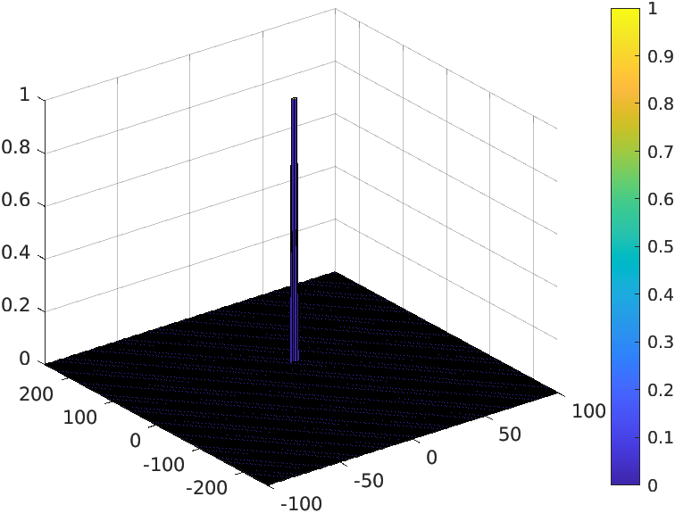

# Udacity Sensor Fusion Radar

## Dependencies
1. Matlab:

## Running
1. cd bin
2. ./matlab

## Results
1. Range measurement:

2. 2D FFT range doppler:

1. 2D CFAR:

## Tasks
The 2D constant false alarm rate (CFAR), when applied to the results of the 2D FFT, uses a dynamic threshold set by the noise level in the vicinity of the cell under test (CUT). The key steps are as follows:

Loop over all cells in the range and doppler dimensions such that it slides the CUT across range doppler map by giving margins at the edges for Training and Guard Cells.
For every iteration sum the signal level within all the trainingcells. 
To sum convert the value from logarithmic to linear using db2powfunction. Average the summed values for all of the training
cells used. 
After averaging convert it back to logarithimic using pow2db.
Further add the offset to it to determine the threshold. 
Next, compare the signal under CUT with this threshold. If the CUT level > threshold assign it a value of 1, else equate it to 0.

## Further improvement
The value for offset is based on trial and error. Will need to investigate more for how to do it more efficiently. 
